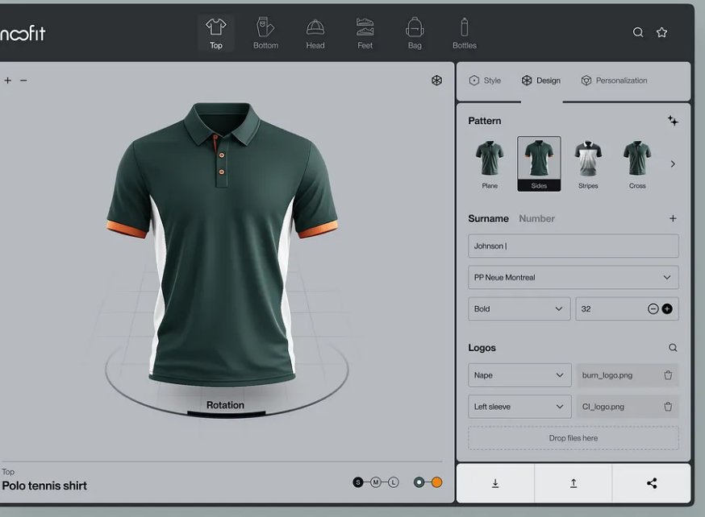

# What the Noofit clothes-builder shot actually specifies

Evidence for a later visual decision. Not a source of truth for the board tool.

## Sources and what could be seen

| Source | Role | What this session actually got |
| --- | --- | --- |
| [Dribbble shot 27647587](https://dribbble.com/shots/27647587-Product-for-a-Clothes-Builder-Noofit) | Primary. Title: **Product for a Clothes Builder ✦ Noofit**. Author line: **Halo UI/UX for HALO LAB**. | Direct HTTP from this environment is AWS WAF-challenged (`HTTP 202`, `x-amzn-waf-action: challenge`, empty body). oEmbed (`/services/oembed`) 404s for this shot **and** for older public Halo shots, so 404 is not proof the shot is gone. |
| Same URL, rendered | Primary image + page chrome. | Full shot page rendered via screenshot of the official URL (thum.io full page 1600×4676; tighter view 1200×1200). This is the only way the pixels were seen. |
| Dribbble image CDN | Original still. | Guessed `cdn.dribbble.com/users/…/screenshots/27647587/…` paths 404. `userupload` id is not in any public index. **No original CDN file saved.** |
| [HALO LAB Dribbble profile](https://dribbble.com/halolab) | Designer page. | Profile HTML also WAF-blocked here. A search-index crawl of that profile lists this shot with tags **design / interface / product / service**. |
| [halo-lab.com/projects](https://www.halo-lab.com/projects) and [sitemap](https://www.halo-lab.com/sitemap.xml) | Agency first party. | Fetched 2026-08-14. **No “Noofit” case, URL, or mention.** Visible cases: Omnibuds, Stay, Pluto, Petspan, Vixiv, ASI-App. Fashion exists only as a filter chip (“Fashion & Beauty”), not as this product. |
| [Behance HALO LAB](https://www.behance.net/halolab) | Same studio, other portfolio. | Fetched 2026-08-14. **No Noofit project.** Recent work is insurance, fintech, pet, productivity. |
| `noofit.com`, `www.noofit.com`, `noofit.io`, `noofit.app`, `noofit.co`, `noofit.shop`, `noofit.es`, `noofit.net`, `getnoofit.com` | Candidate product sites. | **No DNS A/CNAME records** on 2026-08-14. There is no first-party Noofit clothes-builder to open. |
| Wayback CDX for the shot URL | Archive. | Empty. Shot has never been archived. |
| Unrelated “Noofit” | Disambiguation. | A Spanish fitness/training brand uses the same word on Instagram. That is not this UI and was not used. |

**Local research still** (crop of the published shot’s product window, not a CDN original):



The rendered shot page shows **one still**. No extra attachments. No designer caption under the image — only Dribbble “save/like” chrome, a Halo Lab promo banner, and a “More by HALO LAB” row whose thumbnails did not paint in the capture.

Nothing below is inferred from other clothes configurators. If a control is not in that still, it is marked unseen.

## 1. Information architecture

The shot is a **desktop product window** floating on a muted sage-gray studio field (`~#A2ADAE`). The sage is mockup artboard, not app chrome.

Inside the window, four persistent bands:

```
┌─────────────────────────────────────────────────────────────┐
│ WORDMARK          CATEGORY RAIL            SEARCH   STAR    │  dark header
├───────────────────────────────┬─────────────────────────────┤
│                               │  Style | Design | Personal. │
│         3D STAGE              │  ─────────────────────────  │
│     (garment + turntable)     │  Pattern thumbs             │
│                               │  Surname / Number           │
│                               │  Logos + drop zone          │
│  id · size · color            │  download · upload · share  │
└───────────────────────────────┴─────────────────────────────┘
```

| Zone | What sits there |
| --- | --- |
| **Top** | Charcoal header (`~#2D3134`). Left: wordmark `noofit` (geometric grotesque; the *n* is a knotted/looped mark). Center: six product-type icons with labels under the selected one. Right: search, then star (favorites). No project name, no undo, no account. |
| **Left / center** | The stage. Occupies roughly **60%** of the window width. Light cool gray viewport (`~#B7BBC0`). This is the object. |
| **Right** | Inspector card, roughly **40%**. Light gray panel with three domain tabs and a stacked form. Footer is three equal action buttons, not a cart. |
| **Bottom of stage** | Identity + commerce-lite chips: category overline, product name, size, two color dots. Not a timeline, not a status bar. |
| **Bottom of window** | No app-wide status strip. The only footer is the inspector’s download / upload / share row. |
| **Outside the window** | Empty sage field. No left app rail, no OS sidebar, no chat, no price bar. |

Hierarchy, as painted: **garment first**, inspector second, category switcher third, utility icons last. Type in the header is small and quiet. The only large type in the whole frame is the product name on the stage.

## 2. Center stage

A **photoreal 3D garment configurator**, not a flat print mock, not a 2D sewing pattern, not a CAD exploded view.

Observed, all from the still:

- Subject: a short-sleeve **polo**, front/three-quarter, no mannequin and no body. The cloth floats.
- Material look: forest-green knit with visible sheen and soft folds; **white side panels** from underarm to hem; **amber/orange** inner collar, three buttons, and sleeve cuffs.
- Ground: a faint **perspective grid** and a circular **turntable** with tick marks. A dark pill on the ring reads **Rotation**.
- View chrome, top of the viewport: **`+` `−`** (zoom) at left; a **cube** icon at right (view / 3D affordance). No orbit gizmo, no camera labels.
- Stage footer, left: overline `Top` (the active category) and title **`Polo tennis shirt`**.
- Stage footer, right: size chips **S · M · L** with **M** filled dark; two circular swatches, **dark green selected** (ringed) and **orange**.

What the still does **not** show: a back/side camera, a flat pattern, stitch overlay, measurements, fabric name, or a second garment.

## 3. How materials, parts, and options are chosen

The still is on the inspector tab **Design**. **Style** and **Personalization** exist as tabs and are otherwise unseen.

**Pattern (shown).** Heading `Pattern` with a `+` and a right chevron (more in a carousel). Four large thumbs of the *same polo in different panel treatments*, each captioned:

| Thumb | Caption | What the thumb shows |
| --- | --- | --- |
| 1 | Plane | Solid green polo |
| 2 | **Sides** (selected; black caption chip) | Green body, white sides — matches the stage |
| 3 | Stripes | Color-block: pale upper, dark lower |
| 4 | Cross | Green polo, darker crossing / raglan-like panels |

Selection is **whole-object thumbnail**, not a fabric chip, not a hex, not a named wood/cloth. Changing pattern is implied to re-skin the 3D polo.

**Text (shown).** A two-label row: **`Surname`** (active, darker) and **`Number`** (muted), plus a `+`. Under Surname:

- Single-line field with `Johnson` and a caret.
- Font select: **`PP Neue Montreal`**.
- Weight select: **`Bold`**. Size field: **`32`**. Two color dots: white, **black selected**.

This is jersey-name personalization, not a materials system. The name is **not painted on the polo in this frame** (no “Johnson” visible on the chest or nape). Either the type is on an unseen face, or the still is mid-edit.

**Logos (shown).** Heading `Logos` with a search icon. Two placed assets, then a drop target:

- Placement select **`Nape`** → file `burn_logo.png` → trash.
- Placement select **`Left sleeve`** → file `CI_logo.png` → trash.
- Dashed well: **`Drop files here`**.

Parts are chosen by **named garment regions**, not by clicking the mesh. Files are bitmaps. There is no layer stack, no opacity, no print-method control in view.

**Type / size / color (shown on the stage, not in the inspector).** Category lives in the header. Size and color live as chips under the garment. That split is deliberate in the still: **identity of the SKU on the object; decoration in the panel.**

**Unseen, do not invent:** contents of **Style** (cut? collar? fabric?) and **Personalization** (maybe the surname/logo cluster belongs there in a finished product; here it sits under Design). No fabric mill, no GSM, no color name, no price.

## 4. Persistent vs modal

Everything in the still is **persistent in-page**.

- No modal, sheet, popover, toast, or blocking overlay.
- Category, search, and star stay in the header.
- Style / Design / Personalization are **in-panel segmented tabs**, not routes.
- Size and color stay on the stage while the inspector changes.
- File intake is an **inline dashed well**, not a system file-dialog screenshot.
- Export is three always-visible footer buttons: download, upload, share.

The shot specifies a **single-screen builder**. If there is a checkout, a library, or a confirm dialog, this still does not show it.

## 5. Typography, density, color — only as observed

**Type**

- App wordmark: geometric sans, regular/medium, white on charcoal; custom *n*.
- Category labels: ~11–12px, sentence case, muted gray; selected label sits under a raised chip.
- Inspector headings (`Pattern`, `Surname`, `Logos`): dark, semibold, ~14–15px, sentence case, not uppercase tracking.
- Form values: same family, regular; placeholder-like filenames in a lighter gray.
- Stage title `Polo tennis shirt`: the heaviest UI type in the frame, ~16–18px, near-black.
- Overline `Top`: small, muted.
- The typeface *named inside the form* is **PP Neue Montreal**. That is a **user-facing decoration font**, not proven to be the UI font. The UI itself is a clean grotesque of similar temperature.

**Density**

- Medium-low. One object. Large thumbs. Full-width fields. Comfortable padding, no data table, no dual inspector, no scrollbar.
- The inspector is a **short stacked form**, not a property grid. Four pattern choices visible at once.
- No numbers except size `32` and the S/M/L chips. No mm, no price, no SKU code, no stock.

**Color role**

- Chrome is almost **achromatic**: charcoal header, cool gray stage, slightly lighter gray inspector, white footer buttons.
- **Product color does the talking.** Forest green, white panels, amber trim are the only saturated surfaces of any size.
- Selection language is structural, not neon: raised chip on `Top`; underline on `Design`; black caption chip on `Sides`; filled pill on `M`; ring on the green swatch.
- Amber/orange is a **garment trim**, not an app accent. The UI does not reuse that orange for buttons or focus.
- Sage surround belongs to the **Dribbble artboard**, not to a painted app background.

## 6. Steal vs refuse for a board generator

A carpenter is inventing a pattern, seeing the finished board, and reading cuts, glue-ups, stock, and waste. The shot is a **retail 3D merch decorator**. Use the structure; refuse the shop.

### Steal (pattern, not the polo)

- **Object-first split.** Big stage, quieter inspector, almost no top chrome. Matches the three-zone desk already sketched in `ideas.md` more than it matches a marketing landing page.
- **Achromatic chrome, material color as hero.** The board’s species should do what the green/white/amber knit does here. Do not invent a second accent just because the polo has orange cuffs.
- **Whole-object pattern thumbs.** `Plane / Sides / Stripes / Cross` are the garment equivalent of named end-grain layouts. A carpenter should pick a construction the way this UI picks a panel treatment: by seeing the finished object, not a hex chip.
- **Identity on the stage.** Category + name + size/color stay under the object. For a board: species mix, finished size in mm, thickness — not buried in a tab.
- **Named regions for placement.** `Nape` / `Left sleeve` is the right *idea* for “this face / this edge / this juice groove.” Steal the naming, not the logo files.
- **In-panel tabs, no modal.** Cluster concerns (pattern vs stock vs checks) as persistent tabs. Do not hide glue-up behind a dialog.
- **Turntable + zoom as the only view chrome.** Enough to believe the object is spatial. A board also needs end-grain vs edge-grain vs glue-up cameras; the shot does not specify those, only that view controls sit *on the stage*.
- **Medium density.** The still is a product shot, so it is cleaner than a shop tool can stay — but the refusal of card-grid dashboard chrome is usable.

### Refuse (clothes-retail chrome)

- **Catalog mega-nav** (`Top Bottom Head Feet Bag Bottles`). A board tool is not a SKU family switcher. One object type.
- **Surname / Number / PP Neue Montreal / Bold / 32.** Jersey lettering. No analog on an end-grain board.
- **Logo drop + `burn_logo.png` / `CI_logo.png`.** Brand-mark merch. Refuse unless the spec later adds a shop stamp, and even then it is not the core loop.
- **S / M / L.** Fashion sizes. The carpenter needs millimeters and blank counts.
- **Search, star, share, upload-as-footer.** Social/retail utility. A shop tool wants undo, save, print instruction — none of which appear.
- **Photoreal garment as the only truth.** No exploded lamination, no cut list, no kerf, no waste, no “this will not glue.” Pretty stage alone is theatre (the same failure already noted on `client/src/pages/Home.tsx`).
- **Style / Design / Personalization** as the IA. Those words are merchandising. A board IA is closer to pattern / parts / checks.
- **Sage marketing artboard and floating “product shot” window** if it fights a workbench instrument. The *app* in the still is charcoal + gray; the sage is how Halo framed the Dribbble still.
- **Any assumption that Noofit is a real shipped builder** to copy flows from. There is no product site and no Halo case study. This is an agency still.

## What a later visual session can decide without reopening Dribbble

The shot specifies: **dark header, gray 3D stage, light inspector; one photoreal object; pattern-by-thumbnail; decoration form on the right; size/color on the object; no modal; quiet grotesque type; color reserved for the thing being built.**

It does **not** specify: materials science, manufacturing, units, save/print, 2D construction drawings, or a live Noofit system. Pair this still with `ideas.md` (“Артефакт из мастерской будущего”) and `docs/inspiration.html` (ТОРЦЕГРАММА packing/glue-up/print). The steal is the **desk layout and the quiet chrome**. The refuse is **apparel personalization and catalog chrome**. Shop math still has to come from the contest brief and the carpenter, not from this frame.
